# Paimon Programming Language

> A general-purpose, multi-paradigm, statically typed, compiled systems programming language

## Table of Contents

- [Overview](#overview)
- [Project Architecture](#project-architecture)
- [Language Features](#language-features)
  - [Data Types](#data-types)
  - [Compilation](#compilation)
  - [Programming Paradigms](#programming-paradigms)
- [Compilation Pipeline](#compilation-pipeline)
- [Development Workflow](#development-workflow)
- [Git Workflow](#git-workflow)

## Overview

Paimon is designed to be a versatile systems programming language that combines the best features of modern programming paradigms. It supports:

- **Metaprogramming** - Compile-time code generation
- **Functional Programming** - Higher-order functions, currying
- **Message Passing** - Modular component communication
- **Procedural Programming** - Traditional step-by-step instructions
- **Object-Oriented Programming** - Classes, inheritance, polymorphism

## Project Architecture

## Language Features

### Programming Paradigms Support

### Data Types

Paimon supports a wide range of data types:

### Compilation

Paimon supports both native compilation and transpilation to multiple target languages:

## Compilation Pipeline

The Paimon compiler follows a multi-stage pipeline architecture:

## Programming Paradigms

### Metaprogramming

Paimon supports compile-time code generation and allows users to write code that can generate and manipulate other code at compile time. This can be used to:

- Automate repetitive tasks
- Optimize code at compile time
- Provide powerful abstractions
- Generate boilerplate code

### Functional Programming

Paimon provides a powerful functional programming style, allowing users to write programs that are both efficient and easy to understand. Features include:

- Higher-order functions
- Currying and partial application
- Function composition
- Pattern matching
- Immutable data structures

### Message Passing

Paimon allows users to write programs that use the message passing paradigm to communicate between components. This enables:

- Modular architecture
- Decoupled components
- Easier maintenance and extension
- Concurrent and parallel processing

### Procedural Programming

Paimon supports the traditional procedural programming style, allowing users to write programs using simple, step-by-step instructions. This style is:

- Well-suited for systems programming
- Provides fine-grained control
- Efficient for low-level operations
- Familiar to many developers

### Object-Oriented Programming

Paimon provides a powerful object-oriented programming style with support for:

- Classes and objects
- Encapsulation
- Inheritance
- Polymorphism
- Modular and extensible design

## Development Workflow

## Git Workflow

This repository follows a feature-branch workflow with automated deployments:

### Branch Naming Convention

### Contribution Workflow

```mermaid
sequenceDiagram
    participant Dev as Developer
    participant Local as Local Repository
    participant Remote as Remote Repository
    participant CI as CI/CD Pipeline
    participant Review as Code Review

    Dev->>Local: Create feature branch
    Dev->>Local: Make changes
    Dev->>Local: Commit changes
    Local->>Remote: Push to remote
    Remote->>CI: Trigger build & tests
    CI->>CI: Run tests
    CI->>Review: Post results

    alt Tests Pass
        CI-->>Review: ✓ All checks passed
        Review->>Review: Manual review
        Review->>Remote: Approve & merge
    else Tests Fail
        CI-->>Review: ✗ Tests failed
        Review-->>Dev: Request changes
        Dev->>Local: Fix issues
    end
```

## Foreign Function Interface (FFI)

Paimon provides a comprehensive FFI that allows seamless integration with existing codebases:

## Feature Interaction Matrix

---

## Project Status

🚧 **This is currently a design document for the Paimon programming language.**

The repository contains the language specification and design decisions. Implementation is planned for future phases.

### Roadmap

1. **Phase 1: Specification** ✓ (Current)
   - Language design
   - Feature specification
   - Architecture planning

2. **Phase 2: Compiler Frontend** (Planned)
   - Lexer implementation
   - Parser implementation
   - AST design

3. **Phase 3: Type System** (Planned)
   - Type checker
   - Type inference
   - Algebraic data types

4. **Phase 4: Code Generation** (Planned)
   - Native compilation
   - Transpilation to C/C++
   - JavaScript backend

5. **Phase 5: Standard Library** (Planned)
   - Core data structures
   - I/O operations
   - Networking
   - Concurrent programming primitives

---

## License

To be determined.

## Contributing

Contributions are welcome! Please follow the git workflow outlined above when submitting changes.
